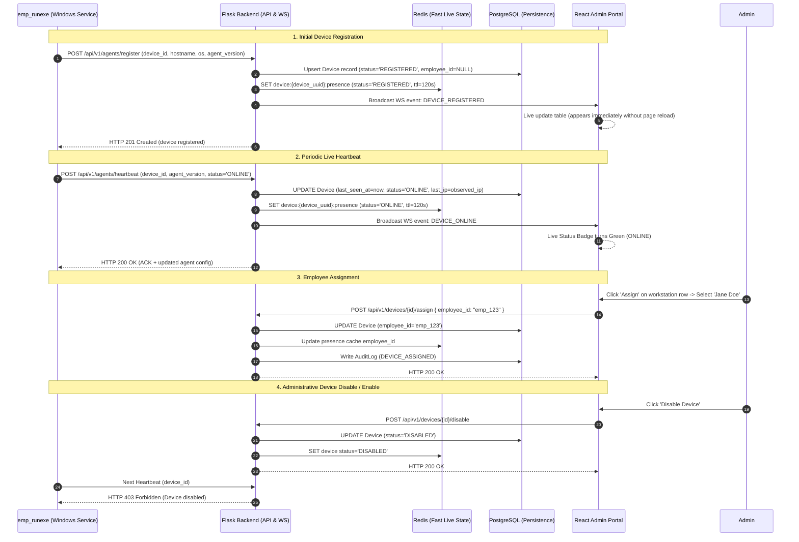

# End-to-End Device Registration & Live Management Flow

This document details the complete lifecycle of a Windows workstation running the `emp_runexe` service connecting to the Web Portal.

---

## Key Lifecycle States

1. **`REGISTERED`**:
   - Workstation has called `POST /api/v1/agents/register`.
   - Employee is `Unassigned` (`employee_id = NULL`).
   - Device appears immediately in portal device inventory.
2. **`ONLINE`**:
   - Periodic heartbeat (`POST /api/v1/agents/heartbeat`) received within the last 60 seconds.
   - Redis key is active (`device:{device_uuid}:presence`).
3. **`STALE`**:
   - No heartbeat received for >60 seconds.
4. **`OFFLINE`**:
   - No heartbeat received for >120 seconds.
   - Watchdog updates status to `OFFLINE` and notifies connected React admins.
5. **`DISABLED`**:
   - An administrator disabled the workstation.
   - All subsequent agent requests receive HTTP 403 Forbidden.
